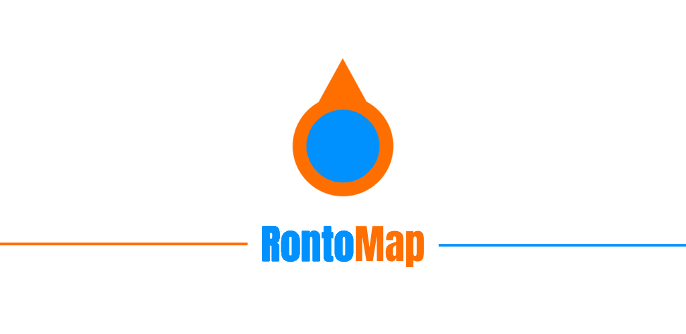

# RontoMap

<a href="https://rontomap.web.app" target="_blank">
  
</a>

Web App:<br>https://rontomap.web.app<br><br>

Support:<br>https://www.paypal.com/ncp/payment/ZRBQZMWTCJYFE<br><br>

<a href="https://play.google.com/store/apps/details?id=hr.strukovnasamobor.rontomap" target="_blank">
  
</a>

## Local setup (Android)

The real Android project is `android-capacitor/` (renamed to free `android/` for a future TWA wrapper). The Capacitor CLI hardcodes the `android/` path, so a directory junction restores it:

```powershell
npm install        # runs scripts/setup-android-junction.ps1 via postinstall
# or manually:
powershell -ExecutionPolicy Bypass -File scripts/setup-android-junction.ps1
```

After that, `npx cap sync android`, `npx cap run android`, and Android Studio (opened on `android-capacitor/`) all work normally. The junction is gitignored.

## License

[](https://creativecommons.org/licenses/by-nc-sa/4.0/)

This project is licensed under [CC BY-NC-SA 4.0](https://creativecommons.org/licenses/by-nc-sa/4.0/).
